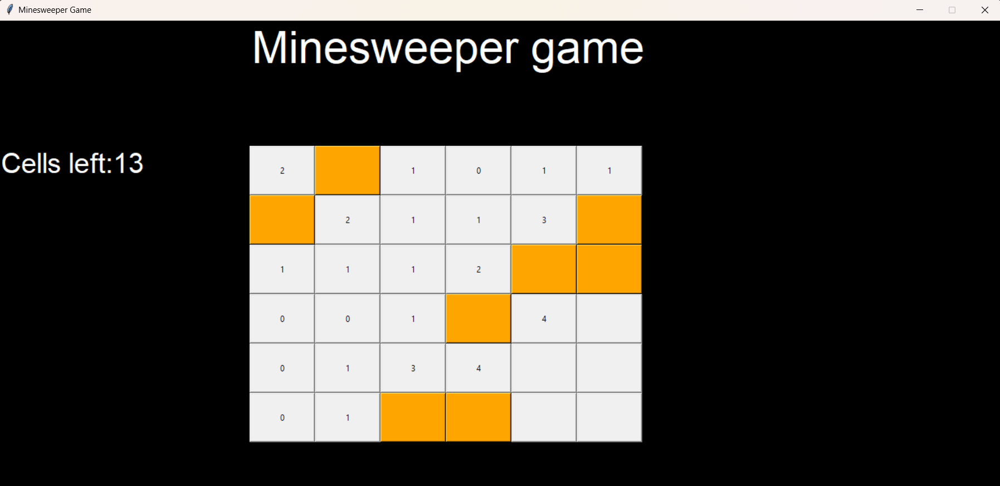

# Minesweeper game

## Description

This is a classic Minesweeper game implemented with Python. The goal of the game is to clear a grid of hidden mines without detonating any of them, with help from clues about the number of neighboring mines in each field.

## Prerequisites

- **Python**: Ensure you have Python installed on your system. You can download Python from [python.org](https://www.python.org/downloads/).
- **Visual Studio Code (VSCode)**: Download and install VSCode from [code.visualstudio.com](https://code.visualstudio.com/).
- **Python Extension for VSCode**: Install the Python extension for VSCode from the Extensions Marketplace.

## Installation and Running 

1. **Clone the Repository**:

    git clone `https://github.com/dgrabo/minesweeper-python.git`

2. **Running the Game**:
   
    In top right corner in Visual Studio Code, press `Run Code` button or press `Ctrl + Alt + N` (for Windows)

## Screenshot of the Game

